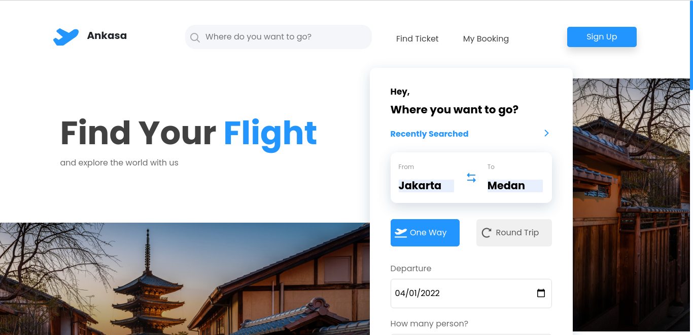
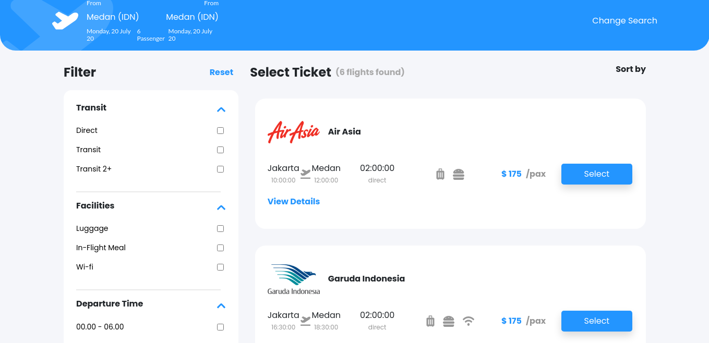
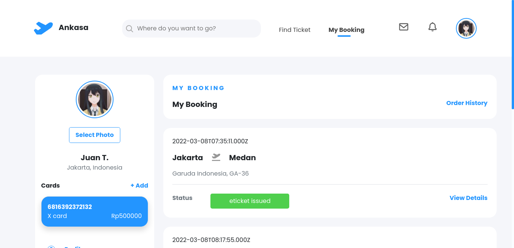
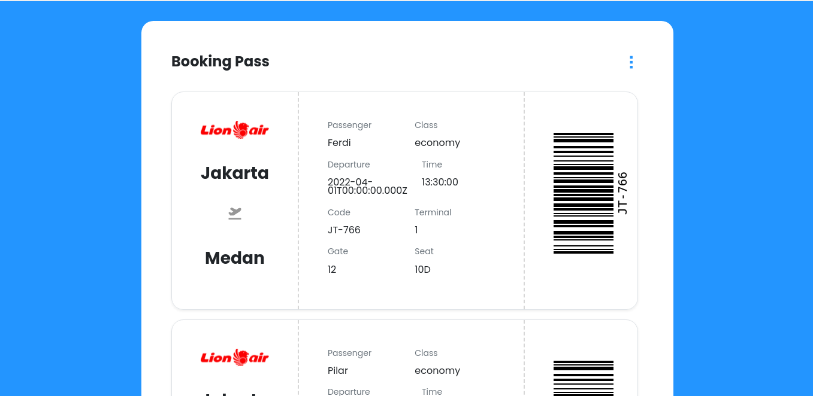

<div id="top"></div>

<!-- PROJECT LOGO -->
<br />
<div align="center">
  <a href="https://github.com/Team-Badai/Ankasa-app">
    
  </a>

  <h3 align="center">Ankasa</h3>

  <p align="center">
    Find Your Flight and Explore the World with Us.
    <br />
    <a href="https://github.com/Team-Badai/Ankasa-app"><strong>Explore the docs »</strong></a>
    <br />
    <br />
    <a href="https://github.com/Team-Badai/Ankasa-app">View Demo</a>
    ·
    <a href="https://github.com/Team-Badai/Ankasa-app/issues">Report Bug</a>
    ·
    <a href="https://github.com/Team-Badai/Ankasa-app/issues">Request Feature</a>
  </p>
</div>

<!-- ABOUT THE PROJECT -->

## About The Project



**Ankasa** is A Website Based Application for Flights Ticket Booking that offers simplicity and rapidity specifically for Indonesian Airlines.

<p align="right">(<a href="#top">back to top</a>)</p>

### Built With

This app was built with some technologies

- [ReactJS](https://reactjs.org/)
- [Redux](https://redux.js.org/)
- [Axios](https://axios-http.com/)
- [Bootstrap](https://getbootstrap.com)
- [Netlify](https://www.netlify.com/)
- [Backend APIs](https://github.com/Team-Badai/Ankasa-API)

<p align="right">(<a href="#top">back to top</a>)</p>

## Getting Started

### Prerequisites

- npm
  ```sh
  npm install npm@latest -g
  ```

### Installation

1. Clone the repo
   ```sh
   git clone https://github.com/Team-Badai/Ankasa-app.git
   ```
2. Install NPM packages
   ```sh
   npm install
   ```
3. Start the Application
   ```sh
   npm start
   ```

## Demonstration

Or you can try it here: [Ankasa Web App](https://ankasa-ticketing-app.netlify.app)

## Snippets

Here are some snippets about this app:

> Web page

|                             Landing Page                              |    Landing Page Mobile    |
| :-------------------------------------------------------------------: | :-----------------------: |
|              |                      |
|                           Registration Page                           | Registration Page Mobile  |
|            |                      |
|                          Search Ticket Page                           | Search Ticket Page Mobile |
|  |                      |
|                             Booking Page                              |    Top Up Page Mobile     |
|                  |                      |
|                              Ticket Page                              |    Ticket Page Mobile     |
|                |                      |

<p align="right">(<a href="#top">back to top</a>)</p>

## Ankasa Update!

**Ankasa** is currently on development process!

<p align="right">(<a href="#top">back to top</a>)</p>

<!-- CONTACT -->

## Related Project

- [Ankasa Backend APIs](https://github.com/Team-Badai/Ankasa-API)

## Contributors

<center>
  <table>
    <tr>
      <td align="center">
        <a href="https://github.com/yuliamassel">
          <br/>
          <sub><b>Yulia Massel Wicaksono</b></sub>
        </a>
      </td>
      <td align="center">
        <a href="https://github.com/pilarhh">
          <br/>
          <sub><b>Pilar H</b></sub>
        </a>
      </td>
      <td align="center">
        <a href="https://github.com/JuanTombeng">
          <br/>
          <sub><b>Juan Tombeng</b></sub>
        </a>
      </td>
      <td align="center">
        <a href="https://github.com/ferdianfh">
          <br/>
          <sub><b>Ferdi Ferdiana</b></sub>
        </a>
      </td>
    </tr>
  </table>
</center>

<p align="right">(<a href="#top">back to top</a>)</p>
