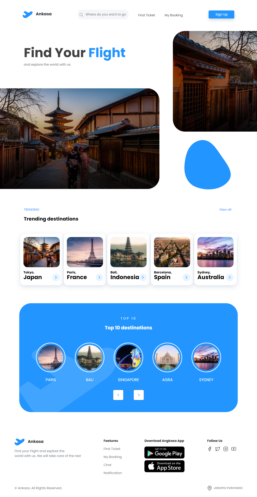
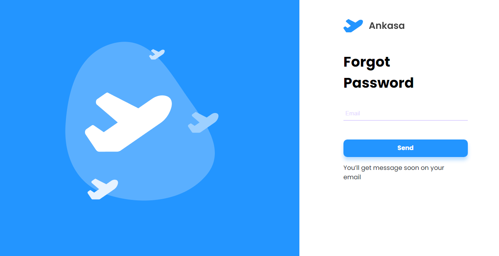

# Ankasa App

Hello we are from team Badai. here we introduce an application Online Flight Booking Has Never Been Easier With Ankasa App. Many destinations All airlines & schedules. Secure instant booking.

# Built With

- React.js

  

## Demonstration

  

Or you can try it here: [Ankasa Web App](https://ankasa-ticketing-app.netlify.app/)

# Installation

1. Clone the repo
   ```sh
   
   git clone: https://github.com/Team-Badai/Ankasa-app.git
   
   ```

2. Install NPM packages

      ```sh

       npm install

   ```

3. Start the Application

	  ```sh

       npm start

      ```

# Pages

  

Some Pages that currently available in **Ankasa**:

  

- **Login**, if you already have an account.
- **Sign Up**, if you need to create an account.
- **Reset Password**, if you already have an account but forgot the password.
- **Explore**, you can check destinations and other activities in this app.
- **Search Result**, You can search or select flights & tickets according to your destination
- **Flight Detail**, here to convince you for flight selection and payment according to the ticket you choose
- **My Booking**, process your transaction or waiting for payment
- **Booking Detail**, Booking pass with barcode
- **Profile**, you can customize or edit your profile.
- **Chat**, you can send message to your family or your friends
- **Notification**,  You can see your notification after making payment or chat

# Snippets

- Explore


  
- Login


- Sign Up


- Reset Password  


